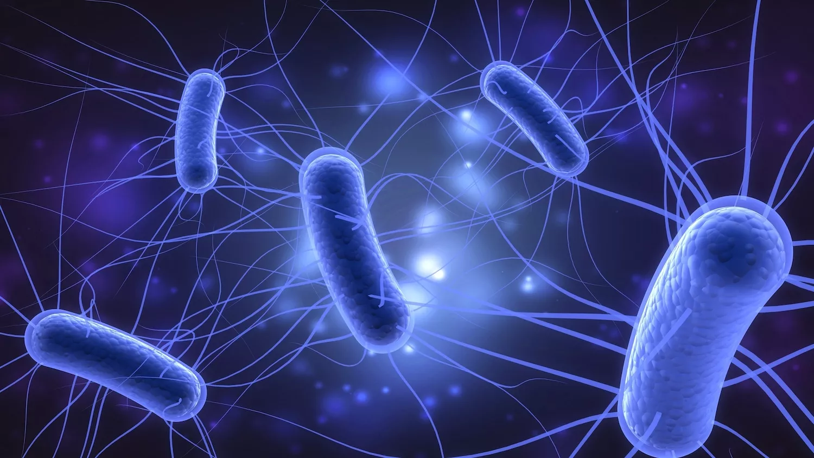

# E.coli Virus Detection

## Table of Content
* [Overview](#overview)
* [Motivation](#motivation)
* [Project Workflow](#project-workflow)
* [Source of Dataset](#source-of-dataset)
* [Data Cleaning Techniques](#data-cleaning-techniques)
* [Exploratory Data Analysis](#exploratory-data-analysis)
* [Model Building](#model-building)
* [Model Performance](#model-performance)
* [Deployment](#deployment)
* [Future scope of project](#future-scope-of-project)

## Overview

In the project, we built a deep learning model that is trained on DNA promoter dataset to understand if a person has the E.coli virus or not.

We will be working with the DNA dataset which holds the information about a small part from the DNA encoded into four types of DNA molecule that are; 
- Adenine (A)
- Cytosine (C)
- Guanine (G) and
- Thymine (T)

We preprocess the data into a more usable format and train the MLP Classifier model. This model is based on Neural Network Architecture and provides very high performance with less training time. Then we created a django-project which becomes our website based that will be hosted on a cloud platform.

MLP Classifier stands for Multi-layer Perceptron Classifier which in the name itself connects to a Neural Network. Unlike other classification algorithms such as Support Vectors or Naive Bayes Classifiers, MLP Classifier relies on an underlying Neural Network to perform the task of classification.

  

## Motivation

## Project Workflow

1. Preprocess the DNA data
2. Train MLP Classifier model
3. 2. Create the django fromt end

## Source of Dataset

## Data Cleaning Techniques

## Exploratory Data Analysis

## Model Building

## Model Performance

## Deployment

## Future scope of project
